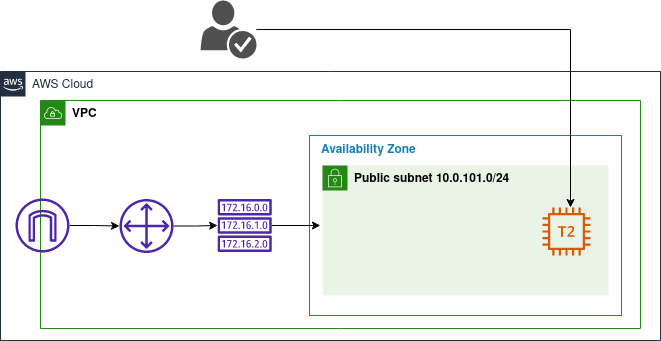

## Diagrama

# Infra estrutura com Terraform na AWS

+ O código cria a infraestrutura na AWS e gera a chave SSH na máquina local
 

## Para utilizar o código

- Verifique o arquivo ___variables.tf___ na raiz do projeto e altere, se for necessário, as variáveis ___namespace___ e ___region___

Execute no seu terminal:

- export AWS_SECRET_ACCESS_KEY="" 
- export AWS_ACCESS_KEY_ID=""

Em seguida, ainda no terminal:

- terraform init
- terraform plan
- terraform apply

## Melhorias

- Criar uma configuração de proxy reverso com o Nginx
- Certificado SSL
- Identificar possibilidade de gerar uma imagem Docker para escalabilidade do serviço
- Balanceador de carga para as instâncias